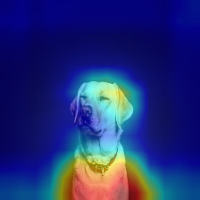
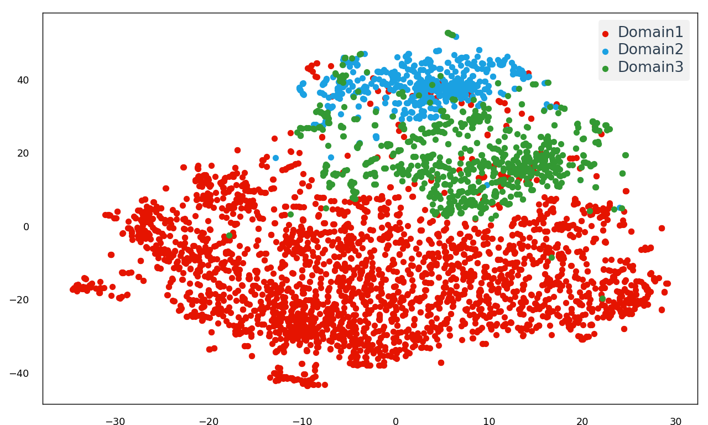
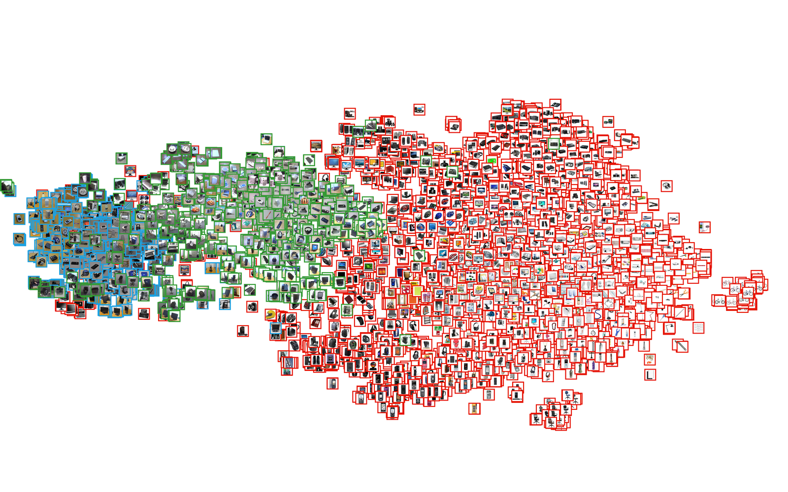
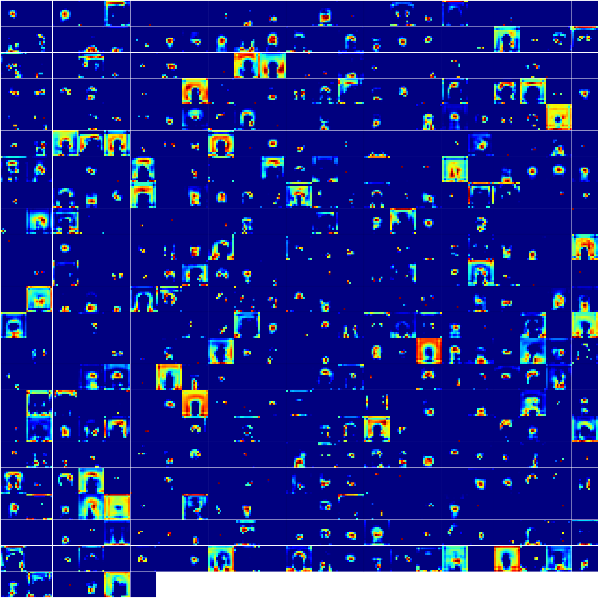

# Visualization Kit for Deep Learning

Deep Learningの分析・可視化とかに利用できるツールをまとめるレポジトリにする予定 <br>
ネットワーク定義ファイルと保存したモデルファイルを用いて色々な可視化・分析するgitにしたい

## Environment
Anaconda3-4.2.0 (python3.5.2)
chainer:2.0.0
cupy:1.0.0


## Grad-CAM
CNNの畳み込み層がどこに注目しているのかを可視化 <br>[https://qiita.com/nagayosi/items/14f243c058f5a1e7044b](https://github.com/tsurumeso/chainer-grad-cam)


|  Original |  Grad-CAM  |  Guided Grad-CAM |
| :---: | :---: | :---:  |
||||

Grad-CAMはCAMと違い，任意のクラスのAttentionを可視化可能<br>
(上記の画像では犬らしさを出力したが，犬の画像に対して猫らしさのヒートマップを出力させることが可能)

## t-SNE
データの相関を可視化<br>
画像そのものを次元圧縮するスクリプトとネットワークの中間層の特徴ベクトルを抽出し，マッピングするスクリプトの2種類を用意．<br>
`pip install bhtsne` が必要 <br>
[https://github.com/dominiek/python-bhtsne](https://github.com/dominiek/python-bhtsne)


マッピングに利用したデータは[Office Dataset](https://people.eecs.berkeley.edu/~jhoffman/domainadapt/)を使用

|  Scatter Ver | Drawing Ver |
| :---: | :---: |
|||


## Feature Map
ある畳み込み層の特徴マップをチャンネル数全て可視化<br>
```畳み込み層```だけに対応していることに注意

[ChainerでCNNしたった - Qiita](https://qiita.com/nagayosi/items/14f243c058f5a1e7044b)

出力画像は上記の犬の画像をVGG-16に入力した時のconv5_3の全特徴マップを可視化した結果

|  VGG-16 Convolution 5-3 Layer  |
|  :--------------------------:  |
||

### How to define Network
いずれ書く (というか見ればなんとなくいけるはず)

### 予定
取り敢えずvgg16.pyを一つにする

common.pyも一つにする

処理をメイン文からクラス・関数化してモジュールとして扱えるようにする

etc 

VGG16モデルが無ければCommon/vgg16.py を実行すればモデルファイルが手に入る(ホント？？)

まだまだ工事中(特にt-SNE)


